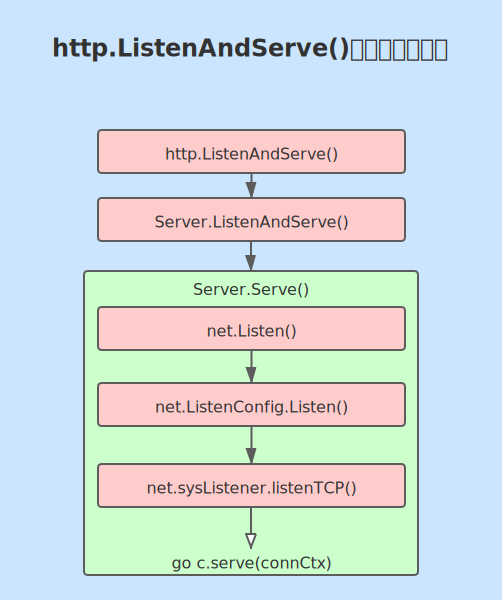

# 【Go从入门到精通】Day01 起步——运行起自己的第一个HTTP服务

>
> 面对真实的自己，因为热爱，所以努力。
>
> 那就……现在开始吧。
> 

## 认识 Golang 标准库提供的 http 包

### 官方资料在这里

网上资料很多，各种博客，文章，专栏甚至视频等。但是关于 golang 的 http 包最重要的知识，也是知识的源头在这里：

[http - The Go Programming Language](https://golang.org/pkg/net/http/)


### Http 如何处理请求

**ListenAndServe** 启动了一个**HTTP 服务程序**，监听指定的**端口号**并且通过给定的**处理函数**来处理请求。

通常 `log.Fatal(http.ListenAndServe(":8080", nil))` 我们会将**ListenAndServe**的**处理函数**参数设置为 `nil` ，以便使用 http 包默认的 **DefaultServeMux** 结构体作为**处理函数**。


ListenAndServe starts an HTTP server with a given address and handler. The handler is usually nil, which means to use DefaultServeMux. Handle and HandleFunc add handlers to DefaultServeMux:

```go
http.Handle("/foo", fooHandler)

http.HandleFunc("/bar", func(w http.ResponseWriter, r *http.Request) {
	fmt.Fprintf(w, "Hello, %q", html.EscapeString(r.URL.Path))
})

log.Fatal(http.ListenAndServe(":8080", nil))
```

### 进入 http.ListenAndServe() 函数

```go

// ListenAndServe listens on the TCP network address addr and then calls
// Serve with handler to handle requests on incoming connections.
// Accepted connections are configured to enable TCP keep-alives.
//
// The handler is typically nil, in which case the DefaultServeMux is used.
//
// ListenAndServe always returns a non-nil error.
func ListenAndServe(addr string, handler Handler) error {
	server := &Server{Addr: addr, Handler: handler}
	return server.ListenAndServe()
}
```
### 进入 Server.ListenAndServe() 函数

```go
// ListenAndServe listens on the TCP network address srv.Addr and then
// calls Serve to handle requests on incoming connections.
// Accepted connections are configured to enable TCP keep-alives.
//
// If srv.Addr is blank, ":http" is used.
//
// ListenAndServe always returns a non-nil error. After Shutdown or Close,
// the returned error is ErrServerClosed.
func (srv *Server) ListenAndServe() error {
	if srv.shuttingDown() {
		return ErrServerClosed
	}
	addr := srv.Addr
	if addr == "" {
		addr = ":http"
	}
	ln, err := net.Listen("tcp", addr)  // 从这里发现 ln 是一个 net.Listener 结构体类型，Accept()方法就是这个结构体的方法。
	if err != nil {
		return err
	}
	return srv.Serve(ln)
}
```


### 进入 Server.Serve() 函数


```go
// Serve accepts incoming connections on the Listener l, creating a
// new service goroutine for each. The service goroutines read requests and
// then call srv.Handler to reply to them.
//
// HTTP/2 support is only enabled if the Listener returns *tls.Conn
// connections and they were configured with "h2" in the TLS
// Config.NextProtos.
//
// Serve always returns a non-nil error and closes l.
// After Shutdown or Close, the returned error is ErrServerClosed.
func (srv *Server) Serve(l net.Listener) error {
	if fn := testHookServerServe; fn != nil {
		fn(srv, l) // call hook with unwrapped listener
	}

	origListener := l
	l = &onceCloseListener{Listener: l}
	defer l.Close()

	if err := srv.setupHTTP2_Serve(); err != nil {
		return err
	}

	if !srv.trackListener(&l, true) {
		return ErrServerClosed
	}
	defer srv.trackListener(&l, false)

	baseCtx := context.Background()
	if srv.BaseContext != nil {
		baseCtx = srv.BaseContext(origListener)
		if baseCtx == nil {
			panic("BaseContext returned a nil context")
		}
	}

	var tempDelay time.Duration // how long to sleep on accept failure

	ctx := context.WithValue(baseCtx, ServerContextKey, srv)
	for {
		rw, err := l.Accept() // 这里调用了 Accept() 方法接收一个请求。 那么这个请求是那里来的呢？
		if err != nil {
			select {
			case <-srv.getDoneChan():
				return ErrServerClosed
			default:
			}
			if ne, ok := err.(net.Error); ok && ne.Temporary() {
				if tempDelay == 0 {
					tempDelay = 5 * time.Millisecond
				} else {
					tempDelay *= 2
				}
				if max := 1 * time.Second; tempDelay > max {
					tempDelay = max
				}
				srv.logf("http: Accept error: %v; retrying in %v", err, tempDelay)
				time.Sleep(tempDelay)
				continue
			}
			return err
		} // 出错重试
		connCtx := ctx
		if cc := srv.ConnContext; cc != nil {
			connCtx = cc(connCtx, rw)
			if connCtx == nil {
				panic("ConnContext returned nil")
			}
		} // 准备好 上下文 参数
		tempDelay = 0
		c := srv.newConn(rw) // 创建一个新的连接结构体 conn
		c.setState(c.rwc, StateNew, runHooks) // before Serve can return
		go c.serve(connCtx)
	}
}
```

### 进入 net.Listen() 方法

```go
// Listen announces on the local network address.
//
// The network must be "tcp", "tcp4", "tcp6", "unix" or "unixpacket".
//
// For TCP networks, if the host in the address parameter is empty or
// a literal unspecified IP address, Listen listens on all available
// unicast and anycast IP addresses of the local system.
// To only use IPv4, use network "tcp4".
// The address can use a host name, but this is not recommended,
// because it will create a listener for at most one of the host's IP
// addresses.
// If the port in the address parameter is empty or "0", as in
// "127.0.0.1:" or "[::1]:0", a port number is automatically chosen.
// The Addr method of Listener can be used to discover the chosen
// port.
//
// See func Dial for a description of the network and address
// parameters.
func Listen(network, address string) (Listener, error) {
	var lc ListenConfig
	return lc.Listen(context.Background(), network, address)
}
```


### 进入 net.ListenConfig.Listen() 方法

```go
// Listen announces on the local network address.
//
// See func Listen for a description of the network and address
// parameters.
func (lc *ListenConfig) Listen(ctx context.Context, network, address string) (Listener, error) {
	addrs, err := DefaultResolver.resolveAddrList(ctx, "listen", network, address, nil)
	if err != nil {
		return nil, &OpError{Op: "listen", Net: network, Source: nil, Addr: nil, Err: err}
	}
	sl := &sysListener{
		ListenConfig: *lc,
		network:      network,
		address:      address,
	}
	var l Listener
	la := addrs.first(isIPv4)
	switch la := la.(type) {
	case *TCPAddr:
		l, err = sl.listenTCP(ctx, la)
	case *UnixAddr:
		l, err = sl.listenUnix(ctx, la)
	default:
		return nil, &OpError{Op: "listen", Net: sl.network, Source: nil, Addr: la, Err: &AddrError{Err: "unexpected address type", Addr: address}}
	}
	if err != nil {
		return nil, &OpError{Op: "listen", Net: sl.network, Source: nil, Addr: la, Err: err} // l is non-nil interface containing nil pointer
	}
	return l, nil
}
```


### 进入 net.sysListener.listenTCP() 方法


```go
func (sl *sysListener) listenTCP(ctx context.Context, laddr *TCPAddr) (*TCPListener, error) {
	fd, err := internetSocket(ctx, sl.network, laddr, nil, syscall.SOCK_STREAM, 0, "listen", sl.ListenConfig.Control)
	if err != nil {
		return nil, err
	}
	return &TCPListener{fd: fd, lc: sl.ListenConfig}, nil
}
```

### 总结 http.ListenAndServe() 调用过程

  

整个调用过程主要思想是：

1. 在操作系统建立 TCP 连接的基础之上建立 http 连接。
2. 通过 `net.sysListener{}` 结构体实现 `net.Listener()` 接口监听 TCP 连接的端口。
3. 通过 `http.ServeMux{}` 结构体实现 http 连接的处理函数、多路复用和路由。
4. 通过 `http.Server{}` 结构体实现所有 http 服务侧的连接管理功能。
5. 最后通过 `go c.serve(connCtx)` 启动一个 **goroutine** 来处理单个请求。


## 使用标准库的例子跑起自己的第一个服务端应用程序


```go 
package main

import (
	"fmt"
	"html"
	"log"
	"net/http"
)

func main() {

	http.HandleFunc("/bar", func(w http.ResponseWriter, r *http.Request) { fmt.Fprintf(w, "Hello, %q", html.EscapeString(r.URL.Path)) })  // 1. 调用 http.HandleFunc() 方法，设置一个 匹配模式 和 一个处理函数。

	log.Fatal(http.ListenAndServe(":8080", nil)) // 2. 在指定端口上启动服务端程序并监听8080端口，处理函数使用默认的 http.DefaultServeMux
}


```